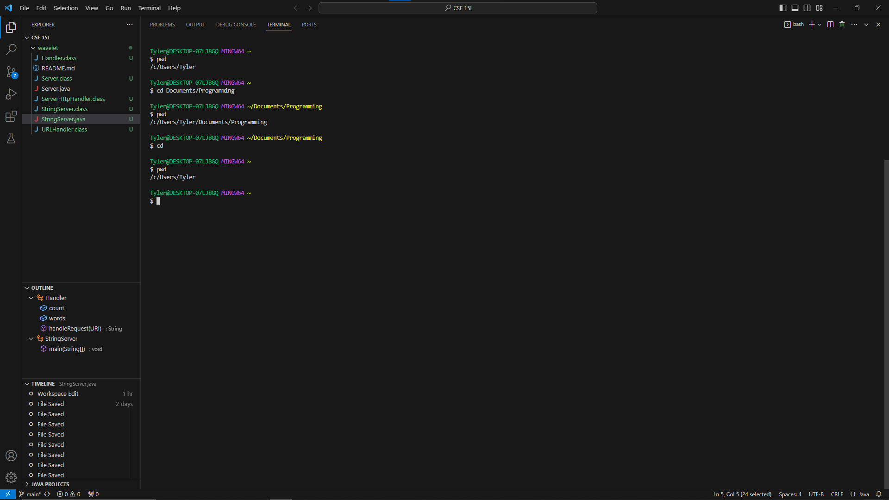

### Lab Report 1

---
**1. Using "cd" command in the terminal**

*with no arguments.*

- The working directory was /home when "cd" was ran.
- The output remained the same and did not change the working directory. This occurred possibly because "cd"
is used to switch the current working directory to the given path directory, provided as an augment. Since 
no augment was provided, the current working directory was not changed, therefore the output 
remained the same.
- Output was not an error

*with a path to a directory as an argument.*

- The working directory was /home when "cd" was ran.
- The output changed as the working directory was now changed to the argument entered after the command "cd"
  in the terminal. Since "cd" now had a proper argument of a directory, the working directory was changed to
  the directory that was entered, /home/lecture1/messages, as "cd" changes the current working directory to the
  path directory entered as an argument after "cd".
- Output was not an error

*with a path to a file as an argument.* 

- The working directory was /home when "cd" was ran.
- The output displayed an error message, because the command "cd" is only used to switch the current working
  directory to the path directory entered as an arguement.
- This is an error, because "cd" does not take files as a directory and only works if a directory path was provided
  as an argument.

---
**2. Using "ls" command in the terminal**

*with no arguments.*

- The working directory was /home when "ls" was ran.
- Entering "ls" into the terminal outputs the list of files and folders from the current working directory. By entering
"ls" into the terminal, the terminal outputted the folder lecture1, because the current working directory was /home, and
the following folder or file inside /home was lecture1.
- Output was not an error

*with a path to a directory as an argument.*

- The working directory was /home when "ls" was ran.
- By entering "ls" into the terminal with a directory as an argument, the terminal displayed the files that were inside the
folder. The argument was /home/lecture1/messages which displayed en-us.txt es-mx.txt ko.txt zh-cn.txt, which were all the
files in the folder messages.
- The output was not an error

*with a path to a file as an argument.* 

- The working directory was /home when "ls" was ran.
- Using a file as an argument for the "ls" command in the terminal, the terminal outputted the entire path leading to the file.
The argument typed was /home/lecture1/messages/zh-cn.txt and the output given was /home/lecture1/messages/zh-cn.txt because
"ls" displays the files and folders based on the given argument. Since the given argument was a file, the file was the very end
of a given path directory, therefore, the entire path leading to the file was given instead, showing there was no other files.
- No output error occured.
  
---
**3. Using "cat" command in the terminal**

*with no arguments.*

- The working directory was /home when "cat" was ran.
- The "cat" command prints out the contents of what was added inside the argument. By providing no arguments, the terminal could
not process the "cat" command and became unresponsive.
- The output was an error because "cat" needs atleast one argument in order to work. Providing no arguments, the "cat" commmand
would be unable to run and became unresponsive the following after.

*with a path to a directory as an argument.*

- The working directory was /home when "cat" was ran.
- When using the "cat" command with a directory as an argument, the "cat" command displayed an error, because the "cat" command
requires a file as an argument and a directory was the given argument, therefore, the cat command displayed an error.
- The output was an error because the "cat" command needs a file path as an argument, therefore by providing a directory path,
the output displayed an error.

*with a path to a file as an argument.*

- The working directory was /home when "cat" was ran.
- Using "cat" with a file as an argument, displayed the contents of the file. With the /home/lecture1/messages/ko.txt path, the
cat command displayed 안녕하세요, which was ko.txt's contents, because the path given lead to ko.txt's content.
- No error was displayed.
  
---
