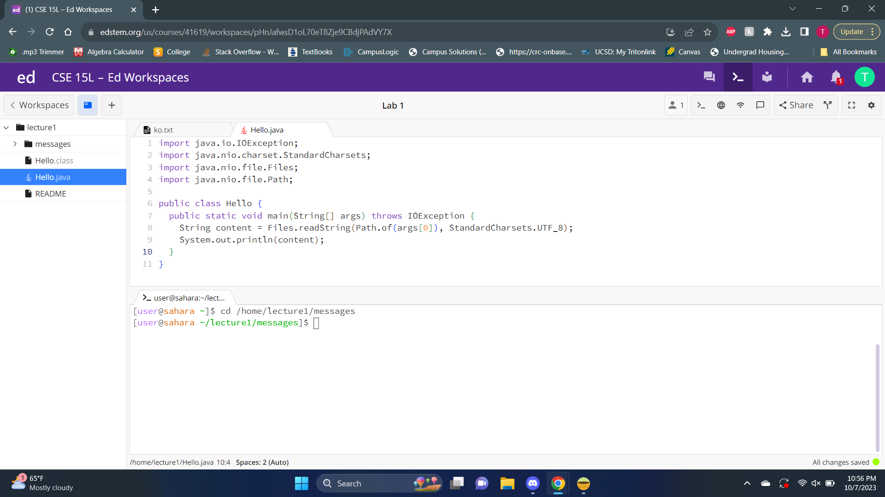
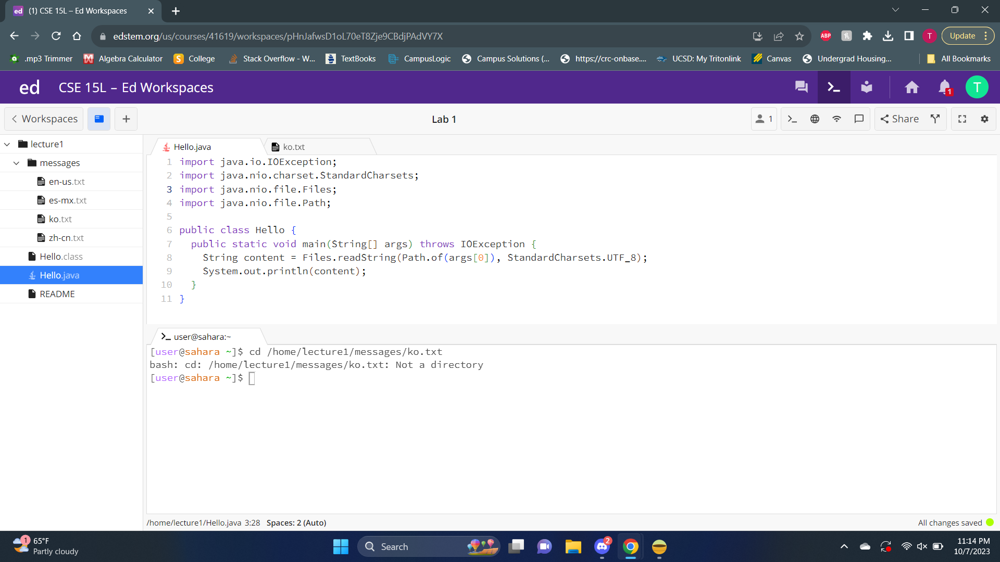

### Lab Report 1

---
**1. Using "cd" command in the terminal**

*with no arguments.*

- The working directory was /home when ran.
- The output remained the same and did not change the working directory. This occurred possibly because "cd"
is used to switch the current working directory to the given path directory, provided as an augment. Since 
no augment was provided, the current working directory was not changed, therefore the output 
remained the same.
- Output was not an error

*with a path to a directory as an argument.*

- The working directory was /home when ran.
- The output changed as the working directory was now changed to the argument entered after the command "cd"
  in the terminal. Since "cd" now had a proper argument of a directory, the working directory was changed to
  the directory that was entered, /home/lecture1/messages, as "cd" changes the current working directory to the
  path directory entered as an argument after "cd".
- Output was not an error
 
  *with a path to a file as an argument.*
  

- The working directory was /home when ran.
- The output displayed an error message, because the command "cd" is only used to switch the current working
  directory to the path directory entered as an arguement.
- This is an error, because "cd" does not take files as a directory and only works if a directory path was provided
  as an arguement.

