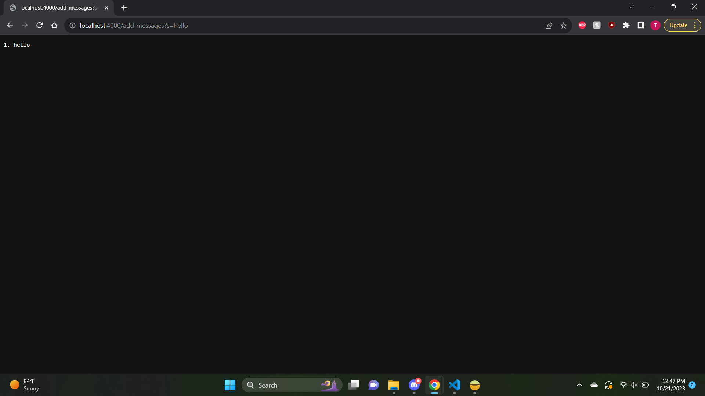
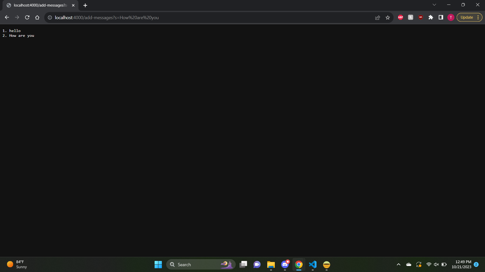

### Lab Report 1

---
**Part 1**

*Code *
```
import java.io.IOException;
import java.net.URI;

class Handler implements URLHandler {
    
        int count = 1;
        String[] words = new String[2];

        public String handleRequest(URI url) {
            if (url.getPath().equals("/")) {
                if (count == 1) {
                    words[1]= "empty";
                    return String.format("This is your added string list\n%s", words[1]); 
                } 
            return String.format("This is your added string list\n%s", words[1]);    
            } else {
                if (url.getPath().contains("/add-messages")) {
                    String[] parameters = url.getQuery().split("=");
                        if (parameters[0].equals("s")) {
                            words[0] = String.format("%d. %s\n", count, parameters[1]); 
                            count++;
                            if (count == 2) {
                                words[1]= "";
                            }
                            words[1] = words[1] + words[0];
                            return words[1];
                        }
                    }
            } 
            return "404 Not Found!";
        }
}

class StringServer {
    public static void main(String[] args) throws IOException {
        if(args.length == 0){
            System.out.println("Missing port number! Try any number between 1024 to 49151");
            return;
        }

        int port = Integer.parseInt(args[0]);

        Server.start(port, new Handler());
    }
}
```
*after /add-message?s=hello command*

-
-
-

*after /add-message?s=How are you? command*

-
-
-


**Part 2**
---

**Part 3**
---


