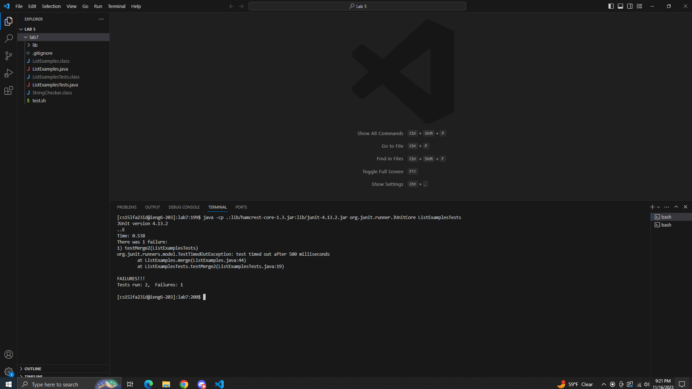
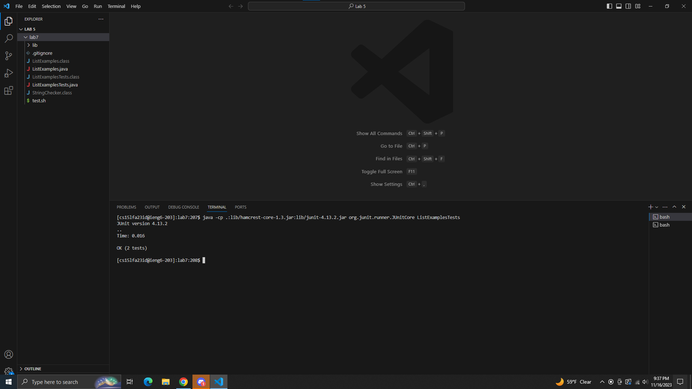

### Lab Report 4 ###

---
Step 4: Log into ieng6

  ssh < Ctrl + v of cs15lfa23id@ieng6.ucsd.edu > < Enter >

- Using the ssh command allowed us to log into ieng6 machine. With the help of < Ctrl + v > we were able to paste cs15lfa23id@ieng6.ucsd.edu
from our clipboard into the terminal line and then presseing enter allowed us to log straight into the ieng6 machine.

Step 5: Clone your fork of the repository from your Github account (using the SSH URL)

  git clone < Ctrl + v of git@github.com:tylercooksrice/lab7.git > < Enter >

- git clone allowed us to clone our repository from my github and with the usage of < ctrl + v >, we could paste our forked repository of 
git@github.com:tylercooksrice/lab7.git into the terminal line. With the press of the < Enter > key, we were able to clone our repository 
into the ieng6 machine.

Step 6: Run the tests, demonstrating that they fail

  cd la< Tab >b7/ < Enter >
  < Ctrl + v of javac -cp .:lib/hamcrest-core-1.3.jar:lib/junit-4.13.2.jar *.java > < Enter >
  < Ctrl + v of java -cp .:lib/hamcrest-core-1.3.jar:lib/junit-4.13.2.jar org.junit.runner.JUnitCore ListExamplesTests > < Enter >

- using cd, we can get into the directory of lab7 that was clones. With the usage of tab, we were able to autocomplete lab7 after typing la. 
Pressing < Enter > brought us into the lab7 directory. With the < Ctrl + v > command again, we pasted from our clipboard 
javac -cp .:lib/hamcrest-core-1.3.jar:lib/junit-4.13.2.jar *.java to compile the .java and Junit tests inside lab7.

Step 7: Edit the code file to fix the failing test

  vim ListExa< Tab >mples.java < Enter >
  /index1 < Enter > 9nexi2 < Esc > :wq 

- To edit the ListExamples.java file, we used vim and with the help of tab to autocomplete our argument. With the press of the <Enter> key
we were presented with the ListExamples.java file. Using / to find index1, we were able to find it quickly after typing 9n after pressing Enter.
Upon finding index1, we pressed on e to bring us to the end of the variable, and with x, we deleted 1 from index1 and with i, we entered in 2 for 1
and pressed < Esc > to save the insert change. With :wq, we saved our changes into the ListExamples.java file.

Step 8: Run the tests, demonstrating that they now succeed

  < Ctrl + r > javac < Enter >
  < Ctrl + r > java < Enter >

- With < Ctrl + r > we searched up in our command history for javac -cp .:lib/hamcrest-core-1.3.jar:lib/junit-4.13.2.jar *.java and with the < Enter > key,
we compiled our .java files and Junit Tests. With < Ctrl + r > again, we typed in java to search in our command history for 
java -cp .:lib/hamcrest-core-1.3.jar:lib/junit-4.13.2.jar org.junit.runner.JUnitCore ListExamplesTests. Pressing < Enter > allowed us to run the tests, and 
show that the ListExamples.java file works properly.

Step 9: Commit and push the resulting change to your Github account (you can pick any commit message!)

  git add ListE< Tab >xamples.java < Enter > i done < Esc > :wq
  git push

- To commit and push our change, git add was typed in and with the help of the < Tab > key, we autofilled ListExamples.java after only typing in ListE. With 
the press of the < Enter > key, we "staged" a file to be part of our next commit. Pressing the < Enter > key and inserting the commit message with i, we added ListExamples.java
into the next commit with "done" as the commit message. With the < Esc > key, we exited insert mode and typed in :wq to save the commit message. With git push, we pushed our 
new commit into our Github.
