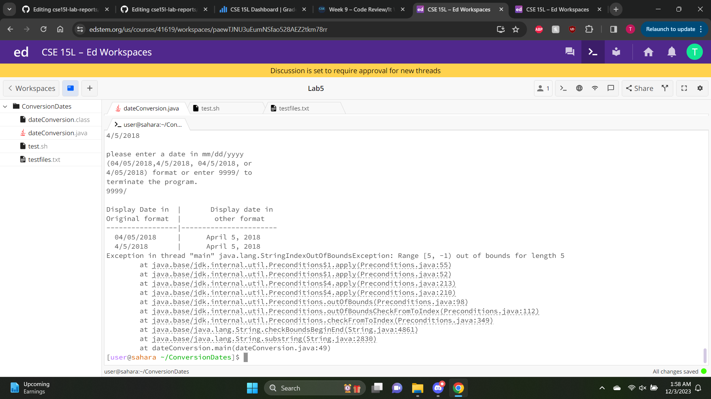
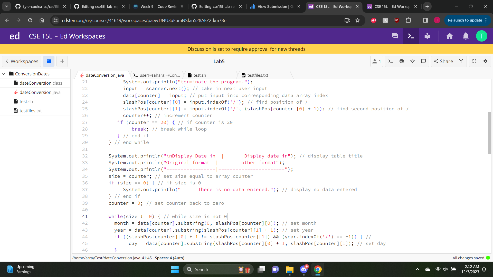
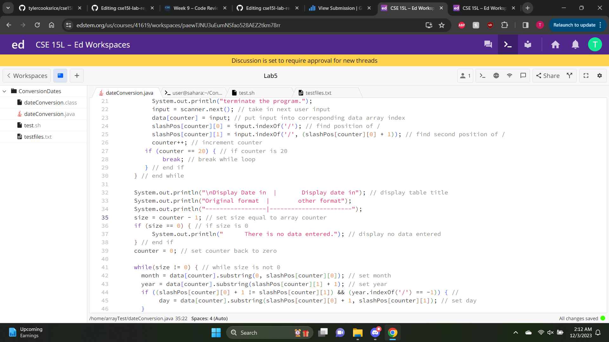

### Lab Report 5 ###

---
Part 1:
  1. Original Post
  
  Student Response: I believe that the error in my code is that the counter variable in my code is not being assigned correctly
  properly as an out of bound error is occuring within the code.
  
  2. TA Response
  TA Response: I would suggest maybe to look at the while loop for displaying the dates, as one of the comparisons for a loop
  can be changed to prevent such error from occuring or an alternate change that can be made is to one of your counter variables
  being used as one of them is overcounting.
  
  3. Student Fix
  Student Response: The bug was that the size variable that was being used for the while loop had an extra counter variable,
  therefore was giving an out of bound error despite showing the correct output.
  before fix:
  
  
  
  after fix:
  
  

  4. The file & directory structure needed is the home directory as default. In addition to the home directory, there is a
     directory called ConversionDates. Within this directory, there are three files, the dateConversion.java file, the test.sh
     bash file and the testfiles.txt text file.

     Content of dateConversion.java file:
```
      import java.util.Scanner;

      public class dateConversion {
        public static void main(String[] args) {
         String month = ""; // String for month
    	   String year = ""; // String for year
    	   String day = ""; // String for day
    	   int size = 0; // total size of array
    	   int counter = 0; // counter for array
    	   int[][]slashPos; // '/' position of data input
    	   slashPos = new int[21][2]; // column 21, row 2 for slashPos 2d array
    	   String[] data; // array for all data input
    	   data = new String[21]; // array size 21
    	   Scanner scanner = new Scanner(System.in); // scanner for taking in input
    	   String input = ""; // String for user input
    	   while(!input.equals("9999/")) { // while loop to take in input
    	       System.out.println("\nplease enter a date in mm/dd/yyyy"); // display statement
    	       System.out.println("(04/05/2018,4/5/2018, 04/5/2018, or");
    	       System.out.println("4/05/2018) format or enter 9999/ to");
         	   System.out.println("terminate the program.");
    	       input = scanner.next(); // take in next user input
    	       data[counter] = input; // put input into corresponding data array index
    	       slashPos[counter][0] = input.indexOf('/'); // find position of /
    	       slashPos[counter][1] = input.indexOf('/', (slashPos[counter][0] + 1)); // find second position of /
    	       counter++; // increment counter
    		 if (counter == 20) { // if counter is 20
    		      break; // break while loop
    		 } // end if
    	  } // end while
    	  System.out.println("\nDisplay Date in  |       Display date in"); // display table title
    	  System.out.println("Original format  |        other format");
    	  System.out.println("-----------------|-----------------------");
    	  size = counter - 1; // set size equal to array counter
    	  if (size == 0) { // if size is 0
    	       System.out.println("      There is no data entered."); // display no data entered
    	  } // end if
    	  counter = 0; // set counter back to zero
    	  while(size != 0) { // while size is not 0
    		month = data[counter].substring(0, slashPos[counter][0]); // set month
    		year = data[counter].substring(slashPos[counter][1] + 1); // set year
    		if ((slashPos[counter][0] + 1 != slashPos[counter][1]) && (year.indexOf('/') == -1)) { // 
    		     day = data[counter].substring(slashPos[counter][0] + 1, slashPos[counter][1]); // set day
    		}
    		else if (slashPos[counter][0] + 1 != slashPos[counter][1]) {
    		     int temp1 = data[counter].indexOf('/', slashPos[counter][1]); // set and create temp1 to 
    		     day = data[counter].substring(slashPos[counter][0] + 1, slashPos[counter][1]);
    		     year = data[counter].substring(temp1 + 2);	 
    		}
    		else if (slashPos[counter][0] + 1 == slashPos[counter][1]) {
    		     int temp1 = data[counter].indexOf('/', slashPos[counter][1] + 1);
    		     year = data[counter].substring(temp1 + 1);
    		     day = data[counter].substring(slashPos[counter][1] + 1, temp1);
    		     if (year.indexOf('/') != -1) {
    		          year = year.substring(1);
    		     }
    		}
    		if (day.indexOf('0') == 0) {
    		    day = day.substring(1);
    		}
    	      System.out.print(String.format("  %-15s|", data[counter]));
    		if (month.equals("01") || month.equals("1")) {
    		    System.out.printf("      January %s, %s%n", day, year);
    		}
    		if (month.equals("02") || month.equals("2")) {
    		    System.out.printf("      February %s, %s%n", day, year);
    		}
    		if (month.equals("03") || month.equals("3")) {
    		    System.out.printf("      March %s, %s%n", day, year);
    		}
    		if (month.equals("04") || month.equals("4")) {
    		    System.out.printf("      April %s, %s%n", day, year);
    		}
    		if (month.equals("05") || month.equals("5")) {
    		    System.out.printf("      May %s, %s%n", day, year);
    		}
    		if (month.equals("06") || month.equals("6")) {
    		    System.out.printf("      June %s, %s%n", day, year);
    		}
    		if (month.equals("07") || month.equals("7")) {
    		    System.out.printf("      July %s, %s%n", day, year);
    		}
    		if (month.equals("08") || month.equals("8")) {
    		    System.out.printf("      August %s, %s%n", day, year);
    		}
    		if (month.equals("09") || month.equals("9")) {
    		    System.out.printf("      September %s, %s%n", day, year);
    		}
    		if (month.equals("10")) {
    		    System.out.printf("      October %s, %s%n", day, year);
    		} 
    		if (month.equals("11")) {
    		    System.out.printf("      November %s, %s%n", day, year);
    		}
    		if (month.equals("12")) {
    		    System.out.printf("      December %s, %s%n", day, year);
    		}
    		counter++;
    		size--;
    	  }
      }
     }
```
Content of test.sh file:
```
javac dateConversion.java
java dateConversion 
```

Content of testfiles.txt
```
3/8/1555
9/5/2015
9999/
```

command to trigger bug:
`bash test.sh 
3/8/1555 
9/5/2015 
9999/`

To fix the bug, one must find the size variable and assign that variable correctly as the size 
variable is assigned to the counter variable, which is counting how many inputs there are. By subtracting
one from the size variable for the while loop, the error would not appear and the output should be correct.

---
Reflection:
One of the coolest things I learned from lab throughout the quarter was being able to use a virtual computer 
from my laptop. I never knew that was possible and it was very cool to be able to do it for the first time. I 
also liked learning about bash script command, although I wish we spent more time on them as they were hard using
because of their syntax. 


